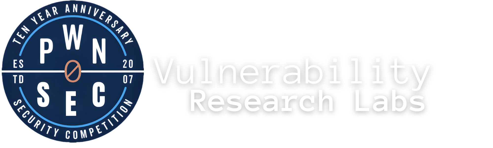

  
    

</a>
A young person who has high curiosity. Has experience as a Pentester & Digital Strategist for more than 11 years. Currently a Cyber Security Expert for several overseas companies. Really enjoying his current life as a full-time remote worker. These two things are now probably very attached to me personally. Because I have a very high curiosity, I often spend time doing anything that I think can spend my free time. I am currently actively writing about the world of cyber security at Pwn0sec. In addition to having a hobby of writing, I am currently also a Security Pentester in several companies abroad. Starting from an accident, it now officially attracts me to become a Pentester. Being a Pentester makes me free, no need to live monotonously and have to work every day in the office. Basically, I can work anywhere. Yes, I am a full-time remote worker. 💡

### 🖿 Open Source Project

Below is a list of tools I've developed, which are designed to assist in various cybersecurity tasks:

| Name | Description | Link |
|-----------|-------------|------|
| **LFISecOps** | Advanced Tool To Scan And Exploit Local File Inclusion (LFI) Vulnerabilities. | [GitHub](https://github.com/andrisecops/LFISec) |
| **PwnXSS** |A powerful XSS scanner made in python 3.7 | [GitHub](https://github.com/pwn0sec/PwnXSS.git) |
| **PHPvulnerabilities** |PHP Vulnerability Scanner adalah alat yang dirancang menggunakan API ChatGPT untuk mengidentifikasi kerentanan keamanan dalam aplikasi PHP melalui CVE/CVND. | [GitHub](https://github.com/andrisecops/PHPvulnerabilities) |
| **Shotrack** |automatic tool untuk menganalisis keamanan IP dan Domain menggunakan API Shodan mengumpulkan informasi tentang IP dan Domain, mengidentifikasi potensi kerentanan terkait versi teknologi yang dipetakan oleh Shodan, dan melakukan pencarian CVE di basis data NVD dan ExploitDB. Selain itu, proyek ini mencari Proof of Concepts (PoC) dari CVE di GitHub. | [GitHub](https://github.com/andrisecops/shotrack) |
| **Shoxploit** |A powerful XSS scanner made in python 3.7 | [GitHub](https://github.com/andrisecops/shoxploit) |

### 🛡️ Hall Of Fame

Below is a list of Hall of Fame acknowledgments where my contributions to cybersecurity have been recognized:

| Company | Hall of Fame | Year |
|---------|--------------|------|
|  | [U.S. Dept Of Defense](https://hackerone.com/deptofdefense/thanks/2019) | 2019 |
|  | [International Business Machines Corporation](https://hackerone.com/ibm/thanks/2019) | 2019 |
|  | [Wells Fargo Bank](https://hackerone.com/wellsfargo/thanks/2019) | 2019 |
|  | [Grab](https://hackerone.com/grab/thanks/2022) | 2022 |

 

> [!CAUTION]
> ⚠️ Disclaimer
> Please use the information and exploits provided in my repositories for educational purposes and responsible disclosure only. I am not responsible for any misuse or damage caused by using these tools, scripts, or exploits.

 
